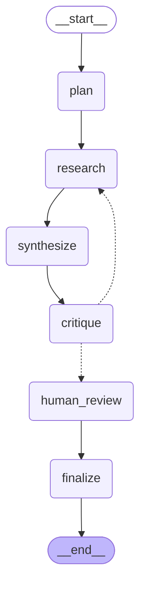

# LangGraph Research Agent

A research assistant built with [LangGraph](https://langchain-ai.github.io/langgraph/).
Give it a question; it plans sub-questions, searches the web, writes a cited
answer, critiques its own work, loops back if the answer has gaps, and pauses
for human approval before finalising.

It is a small project on purpose. Every feature exists to demonstrate one
LangGraph capability that a plain LLM call cannot do.

## The graph



The dotted edges out of `critique` are the conditional edge: if the critic
finds gaps and the revision budget is not spent, the agent loops back and
researches again. Otherwise it goes to human review.

## What each piece demonstrates

| Capability | Where it lives | Why it matters |
|---|---|---|
| Typed shared state | `state.py` | Every node reads and writes one validated `TypedDict` |
| State reducers | `Annotated[list, operator.add]` | Findings **accumulate** across loops instead of overwriting |
| Tool use | `tools.py` | The agent acts on the world, not just talks |
| Conditional edges / loops | `route_after_critique` | Self-correction — the actual point of a graph framework |
| Loop guard | `max_revisions` | Stops a picky critic from burning your API budget forever |
| Durable checkpointing | `SqliteSaver` in `graph.py` | Every step is saved; runs resume across processes |
| Human-in-the-loop | `interrupt()` in `nodes.py` | Graph pauses mid-run, a human decides, execution resumes |
| Graceful tool failure | `research_node` | A dead search API degrades the answer instead of crashing |

## Setup

```bash
python3 -m venv .venv
source .venv/bin/activate
pip install -r requirements-dev.txt
cp .env.example .env      # then fill in your keys
```

You need two keys:

- `OPENAI_API_KEY` — https://platform.openai.com/api-keys
- `TAVILY_API_KEY` — https://tavily.com (free tier: 1000 searches/month)

## Run it

```bash
python -m research_agent.cli "How do LangGraph checkpointers differ from LangChain memory?"
```

Print the graph diagram instead of running:

```bash
python -m research_agent.cli --graph
```

Resume a previous run by its thread id (this works because of checkpointing):

```bash
python -m research_agent.cli --thread <thread-id> "..."
```

## Tests

```bash
pytest
```

The tests run with **no API keys** — the LLM and search calls are faked — so CI
is free. They cover the routing logic, the loop guard, reducer accumulation,
and tool-failure handling.

## Layout

```
src/research_agent/
├── state.py    # the shared State TypedDict + reducers
├── llm.py      # LLM construction (one place to swap providers)
├── tools.py    # web search
├── nodes.py    # the six nodes + the routing function  <- read this first
├── graph.py    # wiring and compilation
└── cli.py      # command-line entry point
tests/          # runs without API keys
```

## Roadmap

- [x] Plan → research → synthesize → critique loop
- [x] SQLite checkpointing and resumable threads
- [x] Human-in-the-loop approval gate
- [x] Tests + CI
- [ ] Streamlit or FastAPI front end
- [ ] LangSmith tracing (set `LANGSMITH_TRACING=true` — see `.env.example`)
- [ ] Postgres checkpointer for multi-user deployment
- [ ] Vector store for long-term memory across sessions

## A note on the LangGraph API

If you are working from a generated report or tutorial, be careful: several
commonly-hallucinated APIs do not exist. The correct forms, all used here:

| Frequently hallucinated | Actual API |
|---|---|
| `graph.create_runtime().invoke(s)` | `app = builder.compile()` then `app.invoke(s)` |
| `add_conditional_edge(...)` | `add_conditional_edges(source, router, path_map)` — plural |
| router returns a `bool` | router returns the **name of the next node** |
| `Runtime.invoke_with_observability()` | Set `LANGSMITH_TRACING=true` in the environment |
| `ToolNode(SomeTool())` | `ToolNode([tool1, tool2])` — takes a list |

Always check https://langchain-ai.github.io/langgraph/ before trusting a snippet.
